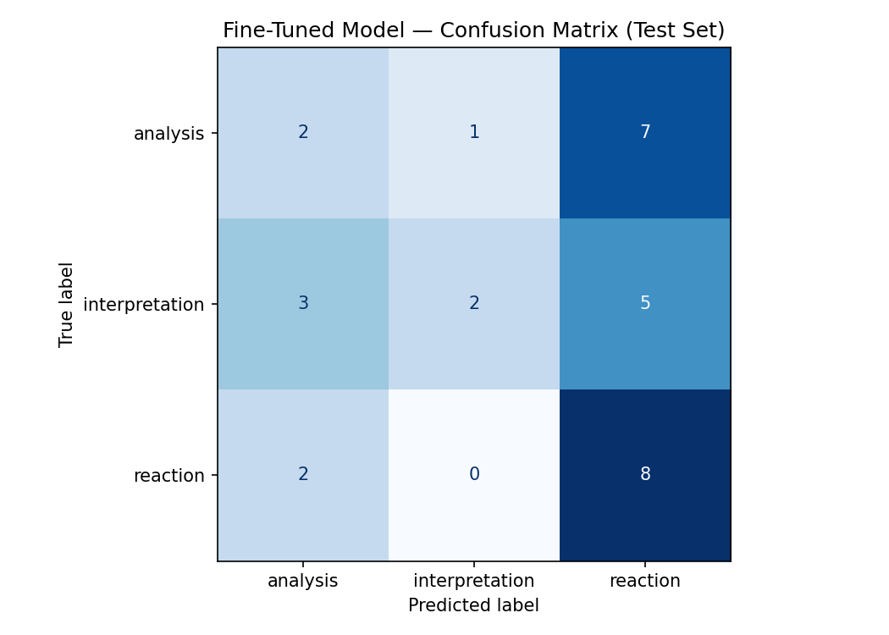

# TakeMeter — Discourse Quality Classifier for r/TrueFilm

**AI201 · Project 3**

---

## Community Choice

**Community:** r/TrueFilm

r/TrueFilm is a film discussion subreddit that positions itself as a space for substantive engagement with cinema. The range of posts spans structured arguments about filmmaking, thematic readings of specific films, and open reactions or requests for recommendations enough variation to make a classification task meaningful. The community's own norms around discourse quality make the distinctions between these modes legible to anyone who participates.

---

## Label Taxonomy

Three labels were defined for this project.

### `analysis`
A post that makes a structured or comparative argument about a film, drawing on directorial approach, craft, or specific observations as evidence. The primary focus is HOW the film was made — technique, cinematography, editing, performance choices, formal structure.

**Example 1:**
Title: *Lars Von Trier's unique approach and other filmmakers like him*
> "Rewatching a few Lars Von Trier films these months (Antichrist being my favorite, but I like most of them), I've come to realize what I find really special and unique about his output is, aside from his great ability to evoke emotions, his particular method of blending classic tragedy and modern pro..."

**Example 2:**
Title: *Fourth Wall Breaks as a Storytelling Tool - Man Bites Dog (1992), Close-Up (1990), and The Holy Mountain (1973)*
> "The majority of films fashion themselves in such a way to reach maximal immersion. It is often said that the technical aspects of filmmaking are at their best when they are so well-integrated that the audience doesn't even realize they are present..."

---

### `interpretation`
A post that offers a thematic or symbolic reading of a specific film — what it means, what a narrative choice signifies, or how to understand a character or ending. The post proposes and defends a reading.

**Example 1:**
Title: *Nocturnal Animals in 2026: The Corrupting Complicity of the Bourgeoisie*
> "Nocturnal Animals is a very good film that doesn't quite reach that status of great. It's also a divisive one, and it reminds me of Almodóvar's Talk to Her in the way it's earned legitimate criticism: both films build themselves around women who don't get to act..."

**Example 2:**
Title: *A line that meant nothing the first watch and completely reframed the whole film on the second*
> "In No Country for Old Men, when Chigurh says, 'You should admit your situation. There would be more dignity in it.' The first watch, I filed it away as a menacing villain line and didn't think much further than that. The second watch, I couldn't stop turning it over..."

---

### `reaction`
A post that is primarily an emotional response, a request for a recommendation, or an open question to the community — not an argument or a thematic reading. If a post asks others for an interpretation without proposing one itself, it is `reaction`.

**Example 1:**
Title: *What films give you the 'The world is changing, old man' kinda vibe?*
> "Looking to watch movies where characters are kinda sad/gloomy about how the world is changing around them - leading to their irrelevance and being reduced to antiques in their lifetime, something that gives you a feeling of helplessness..."

**Example 2:**
Title: *Struggling with Godard*
> "A few years ago, I watched Alphaville, knowing next to nothing about Godard. I am a big fan of arthouse movies and sci-fi, but for some reason, this movie didn't work for me. Over recent months, I've found myself watching Japanese New Wave movies, which I've heard were influenced by Godard..."

---

### Hard edge case: `interpretation` vs. `reaction`

Some posts reference a specific film and ask an open question about its meaning without proposing any reading of their own.

Title: *Is there a deeper meaning behind the ending of bill paxton's 'frailty'*
> "Is the final reveal more than just a supernatural twist. The movie spends most of its runtime making us question whether the father is a delusional religious fanatic, only to possibly validate his beliefs in the end..."

This could be `interpretation` (it's about the meaning of a film's ending) or `reaction` (it's an open question to the community, not a proposed reading).

**Decision rule:** If the post proposes a reading and defends it, even briefly, label it `interpretation`. If the post opens a question for others to answer without asserting a position, label it `reaction`. The test is whether the post asserts a meaning or asks for one.

---

## Data Collection

**Source:** r/TrueFilm, collected via a custom Chrome extension pipeline that scraped public posts from the subreddit feed and post permalinks.

**Total labeled:** 352 posts

**Training dataset:** 200 posts selected from the 352 via stratified cherry-picking to maximize label balance. All 65 `analysis` posts were included (the natural ceiling no more exist in the corpus). The remaining 135 slots were filled with the highest-confidence `interpretation` and `reaction` posts.

**Labeling process:** Each post was read in full (title + body) and assigned one label. Posts where the label was uncertain were flagged with `label_confidence = medium` (140 posts across the full 352); the remainder were marked `high` (212 posts). Only top-level posts were labeled  no comments.

**Text column:** `title + ". " + body` — both fields were visible when each label was assigned, so both are included in the training text.

**Label distribution (training CSV — 200 posts):**

| Label | Count | Percentage |
|---|---|---|
| interpretation | 68 | 34.0% |
| reaction | 67 | 33.5% |
| analysis | 65 | 32.5% |
| **Total** | **200** | |

**Train / validation / test split:** 140 / 30 / 30 (70% / 15% / 15%), stratified by label.

**Test set distribution:** 10 examples per label (perfectly balanced).

---

### Difficult annotation cases

**1.**
Title: *Thoughts on THE DEAD ZONE (1983), directed by David Cronenberg*
> "I think this might be Cronenberg's most grounded film up to this point in his career. Given that it's about a guy with psychic powers, that's saying something. But as much as I was swept up in the plot, I was equally taken along by the emotions of the main character—his confusion, bitterness, resentment..."

This post discusses the film's tone and the director's approach, but reads partly as a personal response. Decision: `analysis`  examines Cronenberg's approach in relation to his other work. Confidence: medium.

**2.**
Title: *Pixar Should Start Planning 40 Year Reissues - Preserving the Canon*
> "Pixar's first 10 films are amongst the greatest late 20th and early 21st century American films, particularly for children/animated works. They aren't necessarily considered amongst the all-time great films by critics, but there are two entries on the extended Sight & Sound list..."

This post argues for a position about preservation and proposes a reading of Pixar's place in the canon. Decision: `interpretation`. Confidence: medium.

**3.**
Title: *Has Hum Dil De Chuke Sanam secretly been restored?*
> "I recently learned that Hum Dil De Chuke Sanam was screened as part of an India–Italy cultural exchange event in Rome. As someone who collects and compares different home-video versions of various films, I also have an interest in restorations..."

This post is a question about a restoration — not a reading, not a structured argument. Decision: `reaction`. Confidence: medium.

---

## Fine-Tuning Approach

**Base model:** `distilbert-base-uncased`

**Training setup:**
- Train / validation / test split: 70% / 15% / 15% (140 / 30 / 30), stratified
- Epochs: 3
- Learning rate: 2e-5
- Batch size: 16 (train), 32 (eval)
- Weight decay: 0.01
- Warmup steps: 50
- Framework: HuggingFace `transformers` + `Trainer`, Google Colab T4 GPU

**Training log:**

| Epoch | Training Loss | Validation Loss | Validation Accuracy |
|---|---|---|---|
| 1 | — | 1.0996 | 0.333 |
| 2 | 1.0964 | 1.0899 | 0.367 |
| 3 | 1.0953 | 1.0733 | 0.433 |

**Hyperparameter decision:** Default settings were used. No adjustments were made before training. The validation accuracy peaked at 43.3% at epoch 3, which already signaled the model was not learning effective boundaries the validation loss barely decreased across all three epochs (1.10 → 1.07), indicating the model was not converging meaningfully.

---

## Baseline

**Model:** Groq `llama-3.3-70b-versatile`, zero shot

**System prompt:**
```
You are classifying posts from r/TrueFilm, a subreddit for serious film discussion.
Assign each post to exactly one of these three labels:

- analysis: Primary focus is HOW the film was made craft, technique, cinematography, editing, direction.
- interpretation: Primary focus is WHAT the film means themes, message, or significance. The post proposes and defends a reading.
- reaction: Primary focus is the writer's personal experience, a recommendation request, or an open question to the community. If a post asks others for an interpretation without proposing one itself, label it reaction.

Respond with ONLY one word: analysis, interpretation, or reaction.
```

**Test set:** 30 examples (10 per label, perfectly balanced). All 30 responses were parseable.

---

## Evaluation Report

### Accuracy

| Model | Accuracy | Test set size |
|---|---|---|
| Zero-shot baseline (Groq llama-3.3-70b-versatile) | 76.7% | 30 |
| fine tuned DistilBERT | 40.0% | 30 |
| Difference | −36.7% | |

### Confusion matrix (fine tuned model)



The fine tuned model predicted `reaction` for the majority of test examples across all three true labels: 7 of 10 `analysis` posts, 5 of 10 `interpretation` posts, and 8 of 10 `reaction` posts were predicted as `reaction`. The model did predict `analysis` for some posts (2 correct, 3 incorrect) and `interpretation` for a small number (1 correct `analysis`, 2 correct `interpretation`), but its overall behavior is still dominated by a pull toward `reaction`.

### Per-class metrics (fine tuned model)

| Label | Precision | Recall | F1 | Support |
|---|---|---|---|---|
| analysis | 0.29 | 0.20 | 0.24 | 10 |
| interpretation | 0.67 | 0.20 | 0.31 | 10 |
| reaction | 0.40 | 0.80 | 0.53 | 10 |
| **macro avg** | **0.45** | **0.40** | **0.36** | **30** |

### Per-class metrics (baseline — Groq llama-3.3-70b-versatile)

| Label | Precision | Recall | F1 | Support |
|---|---|---|---|---|
| analysis | 1.00 | 0.70 | 0.82 | 10 |
| interpretation | 0.62 | 1.00 | 0.77 | 10 |
| reaction | 0.86 | 0.60 | 0.71 | 10 |
| **macro avg** | **0.83** | **0.77** | **0.77** | **30** |

The baseline's failure mode mirrors the fine tuned model's: it overpredicts `interpretation` (recall 1.00, meaning it captured every true `interpretation` post but also pulled in `reaction` posts, lowering precision to 0.62). The fine tuned model's failure mode is over predicting `reaction` across all labels.

### Wrong predictions (fine tuned model)

**Wrong prediction 1**
Text: *Some Final Words about Kubrick's Eyes Wide Shut. I have been active across Reddit for a long time trying to explain Kubrick's enigmatic final film...*
True: `interpretation`. Predicted: `reaction` (confidence: 0.36).
This post proposes a specific thematic reading of Eyes Wide Shut and argues that it has been widely misunderstood. Despite the personal framing ("I have been active across Reddit"), the core is a sustained argument about meaning. The model's low confidence (0.36) reflects genuine uncertainty, but the pull toward `reaction` from personal voice framing won out.

**Wrong prediction 2**
Text: *difference between dubbing and lip sync for movies? So I didnt fully know this but the reason dubbed content feels off...*
True: `analysis`. Predicted: `reaction` (confidence: 0.37).
This post examines a specific technical craft difference — why syllable timing varies between languages and how that causes dubbing to feel unnatural — and compares traditional dubbing to AI lip sync approaches. The question framing in the title likely triggered the `reaction` prediction.

**Wrong prediction 3**
Text: *The Handmaiden….wow. I recently went on a Park Chan-wook binge, which culminated with The Handmaiden……surely this is considered his masterpiece?*
True: `reaction`. Predicted: `analysis` (confidence: 0.34).
This post is a personal response to The Handmaiden — strong impressions, no structured argument. The model predicted `analysis`, likely because the post references cinematography and makes craft adjacent observations ("structurally, the film is incredibly effective"). This is the hardest type of error: a `reaction` post that uses analytical vocabulary.

### Sample classifications (fine tuned model)

| Post (excerpt) | True | Predicted | Confidence |
|---|---|---|---|
| Some Final Words about Kubrick's Eyes Wide Shut... | interpretation | reaction | 0.36 |
| difference between dubbing and lip sync for movies?... | analysis | reaction | 0.37 |
| The Handmaiden….wow. I recently went on a Park Chan-wook binge... | reaction | analysis | 0.34 |
| Finally saw Obsession. Had fun with it... | analysis | reaction | 0.35 |
| Watched Manchester by the Sea today... | interpretation | reaction | 0.35 |

All confidence scores are low (0.34–0.37), indicating that the model never converged it is effectively guessing, with a slight preference for `reaction`.

---

## Reflection: What the Model Learned vs. What Was Intended

The intended boundary was between three modes of discourse: making a craft argument (`analysis`), proposing a thematic reading (`interpretation`), and expressing a reaction or asking a question (`reaction`). Learning this boundary requires understanding what a post is *doing*  its stance not just what words it contains.

Even with a balanced dataset (65/68/67 across labels), the fine tuned model did not learn meaningful boundaries. The training log tells this story directly: validation loss decreased only from 1.10 to 1.07 across three epochs. A well converging model would show a steeper reduction in loss. The model was not finding a signal.

Two reasons account for this:

1. **Task difficulty for a small model.** The distinction between `analysis`, `interpretation`, and `reaction` is about authorial stance — what the writer is *doing*, not what film they are discussing. All three labels use similar vocabulary (film titles, director names, character references), similar personal framing, and similar community registers. DistilBERT, with 140 training examples, did not have enough signal to separate stance from topic.

2. **Low confidence across all predictions.** Every wrong prediction in the notebook output has confidence between 0.34 and 0.37 — barely above random (0.33 for 3 classes). The model was not making confident, wrong predictions; it was making uncertain ones. This points to a model that never developed strong decision boundaries.

The zero shot baseline (76.7%) outperformed the fine tuned model because `llama-3.3-70b-versatile` already understands authorial stance from its pretraining and can apply label definitions directly, without labeled examples. The baseline's macro F1 of 0.77 versus the fine tuned model's 0.36 clearly shows the gap.

---

## Spec Reflection

**One way the spec helped:** The requirement to define a hard edge case before annotating forced a precise decision rule for the `interpretation`/`reaction` boundary — the hardest boundary in this dataset — before any labeling began. This kept the annotations more consistent across 352 posts than they would have been without a written rule.

**One way implementation diverged:** The first training run used an unbalanced dataset (99 reaction / 73 interpretation / 27 analysis), which caused a complete majority class collapse (50% accuracy, all predictions `reaction`). Re-running with a balanced 200 post dataset (65/68/67) improved the result to 40% accuracy and produced a model that at least attempted to predict all three labels — but the improvement was smaller than expected. Balancing the data helped, but was not sufficient on its own; the task itself is hard for a model of this size.

---

## AI Usage

**Instance 1 — Label verification:** Claude (claude-sonnet-4-6) reviewed all 199 posts in the labeled dataset against the planning.md definitions, flagging posts where the assigned label did not match the definition for human review and correction.

**Instance 2 — Code review:** Claude reviewed the notebook code and the Groq system prompt before running, checking that the label definitions in the prompt matched the planning.md taxonomy.
